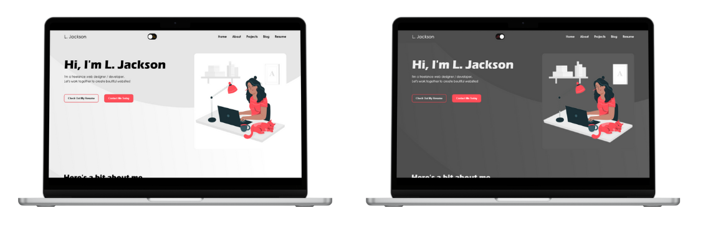

<h2 align="center">
  My Portfolio
   
  <a href="https://l-on-the-web.github.io/lj-portfolio/">visit website</a>
</h2>

My portfolio displays some work I have done in the past. It also features my resume, and a way to contact me via a forum.

## Programs
Made using:
 

  
  
  

 
Forum uses services from Web3Forms.
